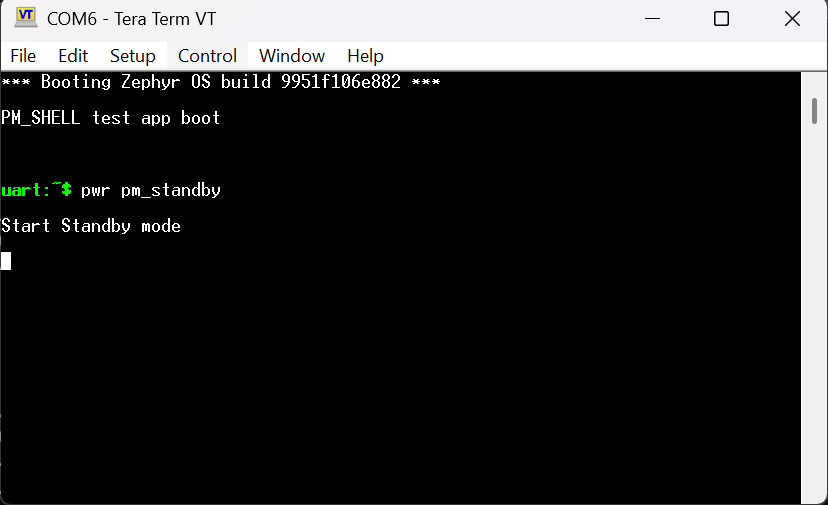
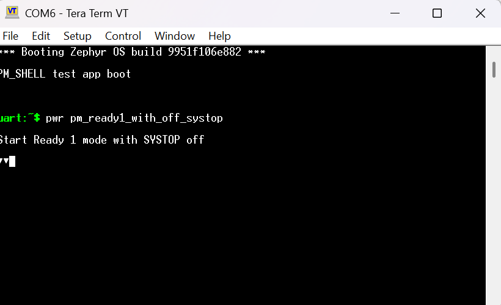

.. _alif-pm-states-sample:

Alif aiPM Power Modes Demo
##################################

Purpose
********

This sample demonstrates exercising certain power profiles and measure the power numbers. This application has a Shell CLI. It allows the following commands(power modes) from Shell CLI. All the commands that are available are for PLL based profiles.
 
 pm_go1

 pm_go3

 pm_ready1_with_systop

 pm_ready1_with_off_systop

 pm_standby

 pm_stop1

 pm_stop2

 pm_stop3

 pm_stop4

 pm_stop5
 

 
Evaluation Board Setup
**********************
Required: 

Devkits

Joulescope

Connections between Joulescope and Ensemble E8 DevKit
*****************************************************
To begin measuring power you will need to cut a shunt S5 on the rear of the Ensemble E8 DevKit and you will need to install a jumper on JP2. After cutting S5 and installing JP2, the MCU will only be powered by a jumper installed on JP2. To supply 3.3V to the MCU, short JP2 pin 2 to JP2 pin 3. To supply 1.8V to the MCU, short JP2 pin 2 to JP2 pin 1. To measure current, you will connect a current measurement device on JP2. Current is sourced from either 1.8V or 3.3V generated by supplies on the DevKit, passes through your current measurement device, and sinks to JP2 pin 2. For calculating power, the voltage is measured at "VDD_MAIN", i.e. JP2 pin 2.

The E8 DevKit allows you to power the MCU from 1.8V or 3.3V depending on jumper placement. For this application note, please remove the jumper on JP2 and connect the meter across pins 2 and 3 to measure current at 3.3V.

.. figure:: ./Media/image31.png

Electrical Connections to Ensemble E8 DevKit

Connections between Joulescope and Ensemble E7 DevKit
To begin measuring power you will need to remove the jumper that is pre-installed on J5 of the Ensemble DevKit. Then you will connect a current measurement device as shown in the image below. GND on the Devkit can be found on pin 1 of any of the four main headers. The 3.3V supply is sourced from J5 pin 2, passes through the current shunt or analyzer, and sinks to J5 pin 1. For calculating power, the voltage is measured at the output on J5 pin 1.

.. figure:: ./Media/image2.png

Electrical Connections to Ensemble E7 DevKit
********************************************

Ensemble E7 DevKits Before Hardware Revision D
Prior to hardware revision D of the DevKit (the revision is visible on the back side of the PCB near jack J23), the CPU Power Supplies schematic looked like Figure 2 CPU Power Supplies Before Rev D which combined VDD_USB_3V3 with other MCU supplies on supply VDD_3V3 after jumper J5 and did not include VDD_BATT. When measuring current on J5, please note that the VDD_USB_3V3 supply contributes an additional 123 uA of always-present leakage added to the total MCU current and you will not see any power consumption due to VDD_BATT. Starting with hardware revision D the VDD_USB_3V3 supply can be disconnected using a newly added Jumper J31. VDD_BATT is now connected after J5 using VDD_3V3.

.. figure:: ./Media/image3.png

CPU Power Supplies Before Rev D

Connections between Joulescope and Balletto B1 / Ensemble E1C DevKit
********************************************************************

To begin measuring power you will need to cut a shunt SH3 on the rear of the DevKit and you will need to install a jumper on JP3. After cutting SH3 and installing JP4, the MCU will only be powered by a jumper installed on JP3. To supply 3.3V to the MCU, short JP3 pin 2 to JP3 pin 1. To supply 1.8V to the MCU, short JP3 pin 2 to JP3 pin 3. To measure current, you will connect a current measurement device on JP3. Current is sourced from either 1.8V or 3.3V generated by supplies on the DevKit, passes through your current measurement device, and sinks to JP3 pin 2. For calculating power, the voltage is measured at "VDD_MAIN", i.e. JP3 pin 2.

The B1 / E1C DevKit allows you to power the MCU from 1.8V or 3.3V depending on jumper placement. For this application note, please remove the jumper on JP3 and connect the meter across pins 1 and 2 to measure current at 3.3V.

.. figure:: ./Media/image36.png

Electrical Connections to Balletto B1 / Ensemble E1C DevKit

Requirements
************

* Alif E7, E8 or Balletto development board
* app-release-exec-<os>-SE_FW_1.109.000, or later 

Supported Board Targets
***********************

* alif_e7_dk/ae722f80f55d5xx/rtss_he
* alif_e1c_dk/ae1c1f4051920hh/rtss_he
* alif_b1_dk/ab1c1f4m51820hh0/rtss_he
* alif_b1_dk/ab1c1f4m51820ph0/rtss_he
* alif_e8_dk/ae822fa0e5597xx0/rtss_he
* alif_e7_dk/ae722f80f55d5xx/rtss_hp (HP core)
* alif_e8_dk/ae822fa0e5597xx0/rtss_hp (HP core)

Building and Running
********************

Example build command for E7:

Build for HE core (TCM boot with retention): 

.. code-block:: console

   west build -p auto -b alif_e7_dk/ae722f80f55d5xx/rtss_he \
       ../alif/samples/aiPM_demo \
       -DCONFIG_FLASH_BASE_ADDRESS=0x0 \
       -DCONFIG_FLASH_LOAD_OFFSET=0x0 \
       -DCONFIG_FLASH_SIZE=256

Build for HP core:

.. code-block:: console

   west build -p auto -b alif_e7_dk/ae722f80f55d5xx/rtss_hp \
       ../alif/samples/aiPM_demo \
       -DCONFIG_FLASH_BASE_ADDRESS=0x0 \
       -DCONFIG_FLASH_LOAD_OFFSET=0x0 \
       -DCONFIG_FLASH_SIZE=256
	   
Example build command for E8:

Build for HE core (TCM boot with retention): 

.. code-block:: console

   west build -p auto -b alif_e8_dk/ae822fa0e5597xx0/rtss_he \
       ../alif/samples/aiPM_demo \
       -DCONFIG_FLASH_BASE_ADDRESS=0x0 \
       -DCONFIG_FLASH_LOAD_OFFSET=0x0 \
       -DCONFIG_FLASH_SIZE=256

Build for HP core:

.. code-block:: console

   west build -p auto -b alif_e8_dk/ae822fa0e5597xx0/rtss_hp \
       ../alif/samples/aiPM_demo \
       -DCONFIG_FLASH_BASE_ADDRESS=0x0 \
       -DCONFIG_FLASH_LOAD_OFFSET=0x0 \
       -DCONFIG_FLASH_SIZE=256

Example build command for B1:
	   
Build for HE core (TCM boot with retention): 

.. code-block:: console

   west build -p auto -b alif_b1_dk/ab1c1f4m51820ph0/rtss_he \
       ../alif/samples/aiPM_demo \
       -DCONFIG_FLASH_BASE_ADDRESS=0x0 \
       -DCONFIG_FLASH_LOAD_OFFSET=0x0 \
       -DCONFIG_FLASH_SIZE=256

	   
Flash the binary using SE Tools. See :ref:`programming_an_application` for details.

Config and building the application:
************************************

Ensure to have the following CONFIG in the prj.conf:

CONFIG_PM =y

CONFIG_SHELL=y

If running only on HE:

CONFIG_RTSS_HE=y

For enabling pm_stop modes 1 to 4, set :

1) #define SOFT_OFF_SUPPORTED to 1 in aiPM_modes.c

2) Set the following node status as okay in alif_b1_pm.dtsi file

.. code-block:: console
   &stop_s2ram {
	   min-residency-us = <21000000>;
	   exit-latency-us = <3000>;
	   status = "okay";
       };

For enabling pm_stop mode 5, set

1) #define SOFT_OFF_SUPPORTED to 1 in aiPM_modes.c

2) Set the following node status as okay in alif_pm.dtsi file

.. code-block:: console
   &subsys_off {
	min-residency-us = <25000000>;

	exit-latency-us = <3000>;

	status = "okay";
   };

For pm_standby mode, set 

1) #define S2RAM_SUPPORTED to 1 in aiPM_modes.c 

.. code-block:: console
    &standby_s2ram {
	min-residency-us = <19000000>;
	exit-latency-us = <3000>;
	status = "okay";
    };

The below durations are set in code
* **Sleep Durations**:

  * RUNTIME_IDLE: 18 seconds
  * S2RAM STANDBY: 20 seconds
  * S2RAM STOP: 22 seconds
  * SOFT_OFF: 24 seconds

Currently our Zephyr infrastructure does not support dynamic frequency scaling, hence the HFRC based modes are measured by bringing up Zephyr in that mode. There is no Shell CLI support for these.

1) To measure pm_go4, enable the following only:

   Set CONFIG_START_WITH_HFRC=y in prj.conf
   
   Ensure SYS_INIT(app_set_go4_params, PRE_KERNEL_1, 46); is enabled in the code
   
   Build and execute the binary, measure the power

2) To measure pm_ready2, enable the following only:
 
   Set CONFIG_START_WITH_HFRC=y in prj.conf
   
   Ensure SYS_INIT(app_set_ready2_params, PRE_KERNEL_1, 46); is enabled in the code
   
   Build and execute the binary, measure the power
   

Executing the application
*************************

To execute the power mode, use the command as below:

Example1: For executing standby mode, please run

pwr pm_standby

Refer to the snapshot below:

Example2: For executing ready mode with systop off, please run

pwr pm_ready1_with_off_systop

Refer to the snapshot below:

